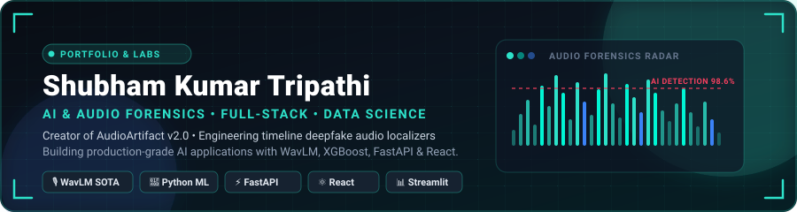
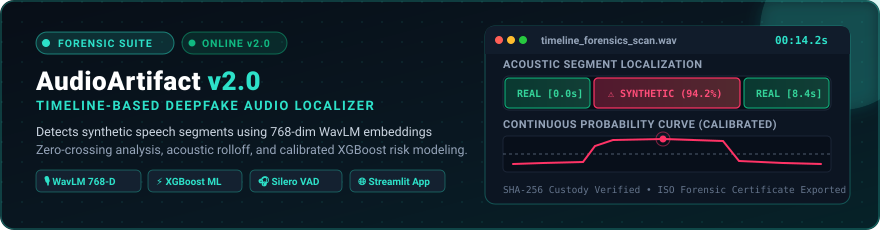

<div align="center">



<a href="https://git.io/typing-svg">
  
</a>

<br/>


<br/>


</div>

---

## 🧠 Who I Am

```ts
const shubham = {
  title: "CSE (Data Science) Student",
  stack: {
    languages: ["Python", "C", "C++", "Java", "JavaScript"],
    frontend: ["HTML", "CSS", "React", "UI/UX Design"],
    backend: ["Node.js"],
    designTools: ["Figma", "Canva"],
    hosting: ["Vercel", "Render", "Netlify", "Railway"],
    devTools: ["Git", "GitHub", "Markdown"],
  },
  launchedProjects: ["AUDIOARTIFACT — Deepfake Audio Detector"],
  certifications: [],
  status: "Building AI-powered tools & sharpening full-stack skills",
  openTo: "Remote opportunities",
};
```

---

## 🚀 Featured Projects

Deepfake audio detector built to identify AI-manipulated voice recordings.

<div align="center">
  
  <br/><br/>
  
</div>

| Layer | Technology |
|---|---|
| Core | Python |
| Domain | Audio / Deepfake Detection |
| Version Control | Git & GitHub |

🔗 [Code](https://github.com/tripathi0704/AUDIOARTIFACT)

---

## 🛠️ Tech Stack

**Languages**
<br/>


**Frontend**
<br/>


**Backend**
<br/>


**Design Tools**
<br/>


**Hosting / Deployment**
<br/>


**Dev Tools**
<br/>


---

## 📊 GitHub Stats

<div align="center">


</div>

---

## 🏆 Trophies

<div align="center">
  
</div>

---

## 📈 Contribution Activity

<div align="center">
  
</div>

---

## 🔗 Connect With Me

<div align="center">

[](https://www.linkedin.com/in/shubham-kumar-tripathi-a5265242b)
[](mailto:shubhamtripathi0704@gmail.com)

</div>

---

<div align="center">

</div>
